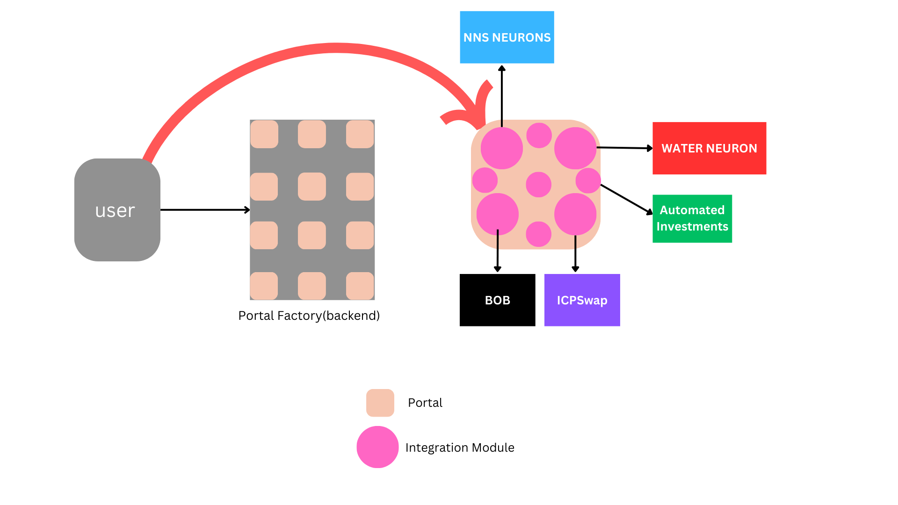

# 🚀 Dearn Protocol

Dearn protocol is a crosschain asset management platform built on the Internet Computer. It allows users to invest, track and manage their assets across the different platforms all in one place.

## 🔧 Technical Architecture



The application consists of mainly three components.

- **Backend** : Responsible for creating and managing `Portals` for the users.

- **Portal** :

  - The portal is a dedicated smart contract that is fully under the control of the user. It is like a command center that allows the user to manage their assets across the different platforms and networks

  - The portal houses all the required functionality and intergation to the different platforms and networks. This allows the user to invest in assets from the different platforms and networks without the need for manually visiting the platforms. Everything is managed within the portal.
    An example, here is that the user can provide liquidity on a pair on ICPSwap all in the Portal without ever visiting the ICPSwap website.

- **Integration Modules**
  These modules are inside each individual portal and are responsible for connecting to the external platforms like icpswap, nns, even to external blockchains to allow the user to invest and manage assets on that platform. When a new module is integrated on the protocol, users are notified to manually upgrade their portals in order to add the new modules to their portals

## 🛠 Technology Stack

- Backend(Motoko)
- Frontend(React)
- Authentication(IdentityKit)

## 📋 To Do

- Advanced Analytics for the user
- Crosschain asset management
- Automate recurring asset purchase and sale
- More trading strategies
- Integrate more platforms in the protocol
- Marketplace to enable trading different miners

## 🚀 Getting Started

Ensure that you have node and dfx installed on your machine

1. Clone the repository

```bash
git clone https://github.com/Protocol
cd Protocol
```

2. Install the dependencies

```bash
npm install
```

3. Deploy the canisters

```bash
dfx deploy
```

4. start the server

```bash
npm start
```

## ⚠️ Disclaimer

This project is still in its early stages of development, Interact with caution.
